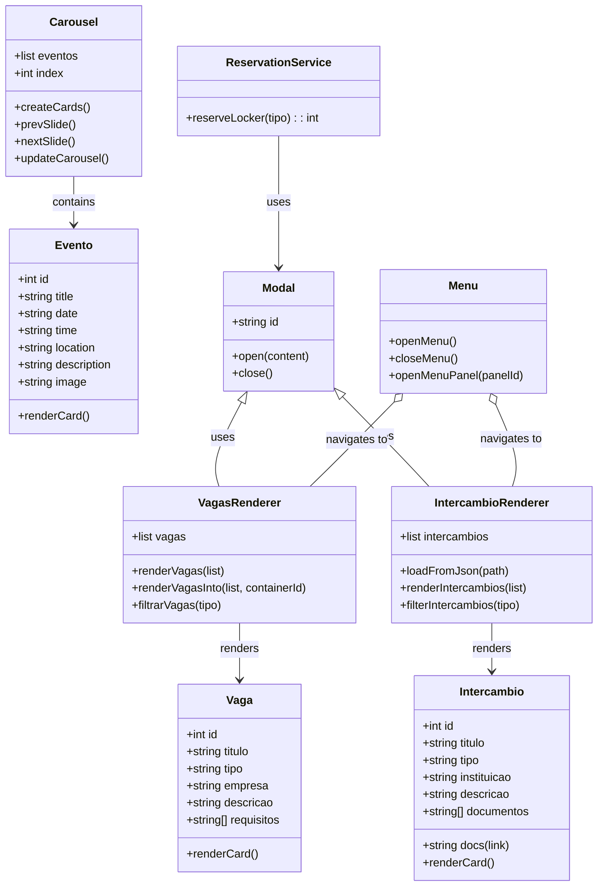

# Diagrama de Classes — Projeto IHM (Interação Homem-Maquina)

Este arquivo contém um diagrama de classes em Mermaid e uma explicação das principais responsabilidades e relacionamentos entre as entidades da aplicação.

## Diagrama (Mermaid)

## Explicação das classes (mapa para o código existente)

- Vaga
  - Representa uma oferta (estágio, emprego).
  - Campos: `id`, `titulo`, `tipo`, `empresa`, `descricao`, `requisitos`.
  - No código atual: array `vagas` em `script.js`. Renderizado por `renderVagasInto()`.

- Intercambio
  - Representa uma oportunidade de intercâmbio (bolsa, bilateral, programa).
  - Campos: `id`, `titulo`, `tipo`, `instituicao`, `descricao`, `documentos`, `docs`.
  - No código atual: `intercambios.json` + `intercambio-helper.js` para carregar e renderizar.

- Evento
  - Itens do carrossel (eventos do campus).
  - No código: `eventos` array e funções `createCards()`, `updateCarousel()`.

- Carousel
  - Gerencia a lista de `Evento` e o índice atual.
  - Métodos: `prevSlide()`, `nextSlide()`, `updateCarousel()`.

- Modal
  - Componente genérico de diálogo (candidatura, NESP).
  - No código: elementos com `id="modal-apply"` e `id="modal-nesp"` e funções `openApplyModal()`, `closeApplyModal()`.

- ReservationService
  - Responsável por reservar armários (lógica simples: `reservarArmario()` retorna um número aleatório).

- Menu
  - Gerencia o painel lateral (`menu_aba`) e a navegação entre painéis.
  - Funções no `script.js`: `openMenu()`, `closeMenu()`, `openMenuPanel(panelId)`.

- VagasRenderer & IntercambioRenderer
  - Responsáveis por montar o DOM das listas (cards), lidar com filtros e botões de ação (detalhes, candidatar, marcar NESP).
  - No código: `renderVagasInto()`, `filtrarVagas()` (vagas) e `intercambio-helper.js` (intercâmbios).

## Observações arquiteturais e sugestões

- Separação clara entre *dados* (arrays / JSON) e *renderers* (funções que montam o DOM). Poderia se beneficiar de classes ES6 para encapsular estado e métodos.
- `Modal` e `ReservationService` podem ser transformados em pequenos singletons/serviços para facilitar testes.
- `intercambio-helper.js` atualmente expõe `loadIntercambiosFromJson` e mantém estado em `window._intercambiosData`; idealmente migrar para um `IntercambioRenderer` que retorna Promises e não polui o `window` global.

---

> Se quiser, eu posso também gerar um SVG do diagrama (imagem) ou converter isso para um PDF/PNG para documentação. Quer que eu gere um arquivo gráfico também?